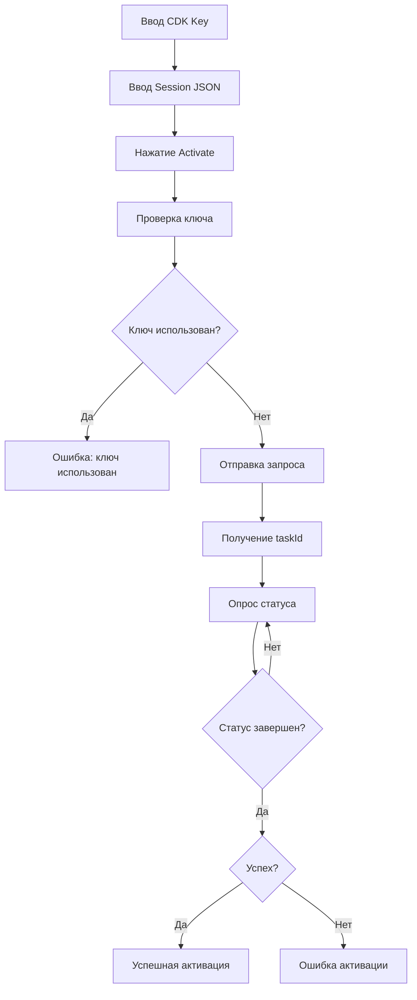

## 1. Обзор продукта
Приложение CDK Activator Web UI представляет собой одностраничное веб-приложение (SPA) для активации ключей ChatGPT через последовательность API-запросов. Пользователи вводят код ключа и JSON сессии, приложение выполняет проверку и активацию в реальном времени с отображением статуса каждого шага.

Продукт решает проблему ручной активации ключей через сложную многоступенчатую процедуру, автоматизируя процесс и предоставляя понятный интерфейс с визуальной обратной связью.

## 2. Основные функции

### 2.1 Пользовательские роли
Для данного продукта разграничение ролей не требуется - все пользователи имеют одинаковые права на активацию ключей.

### 2.2 Модуль функций
Приложение состоит из одной основной страницы:
1. **Главная страница**: форма активации, консоль логов, индикатор прогресса.

### 2.3 Детализация страниц
| Название страницы | Название модуля | Описание функции |
|-------------------|-----------------|------------------|
| Главная страница | Заголовок | Отображение названия "GPT CDK Activator" |
| Главная страница | Поле CDK Key | Ввод кода ключа (обязательное поле) |
| Главная страница | Поле Session JSON | Ввод JSON сессии (обязательное поле, 5-6 строк) |
| Главная страница | Кнопка Activate | Запуск процесса активации с индикатором загрузки |
| Главная страница | Консоль логов | Отображение статуса выполнения (успех - зеленый, ошибки - красный) |

## 3. Основной процесс
Пользовательский поток активации ключа:

1. Пользователь вводит CDK Key в текстовое поле
2. Пользователь вводит Session JSON в многострочное поле
3. Нажимает кнопку "Activate"
4. Система выполняет проверку ключа через API
5. При успешной проверке отправляет запрос на активацию
6. Получает taskId и начинает опрос статуса каждые 2 секунды
7. Отображает финальный результат в консоли

## 4. Пользовательский интерфейс

### 4.1 Стиль дизайна
- **Цветовая схема**: темная тема (dark mode)
- **Первичный цвет**: синий (#3B82F6)
- **Вторичный цвет**: серый (#6B7280)
- **Цвет успеха**: зеленый (#10B981)
- **Цвет ошибки**: красный (#EF4444)
- **Стиль кнопок**: скругленные углы, современный flat-дизайн
- **Шрифт**: системные шрифты (sans-serif), размер 14-16px для основного текста
- **Компоновка**: вертикальная, центрированная, карточная структура

### 4.2 Обзор дизайна страниц
| Название страницы | Название модуля | UI элементы |
|-------------------|-----------------|-------------|
| Главная страница | Заголовок | Крупный текст, белый цвет, центрирование |
| Главная страница | Форма ввода | Темные поля с серыми границами, плейсхолдеры |
| Главная страница | Кнопка Activate | Синяя кнопка с hover-эффектом, спиннер загрузки |
| Главная страница | Консоль логов | Темный фон, моноширинный шрифт, цветовая кодировка сообщений |

### 4.3 Адаптивность
Приложение разработано с приоритетом desktop-first, адаптивно под мобильные устройства. Минимальная ширина экрана 320px. Touch-оптимизация не требуется.