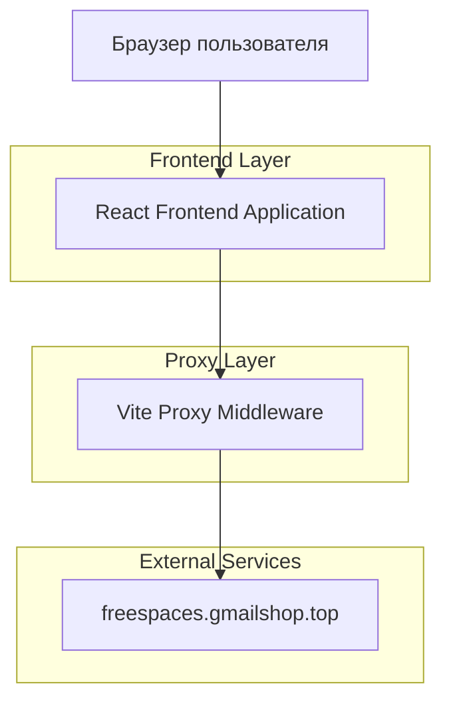
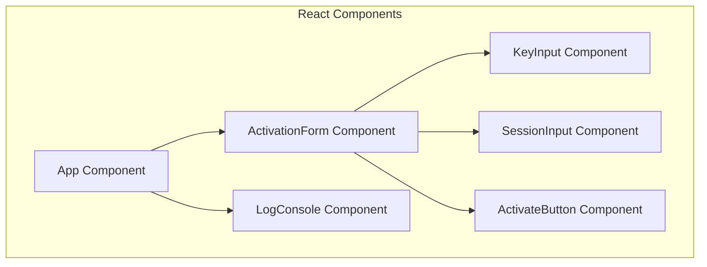

## 1. Архитектура системы



## 2. Технологический стек

- **Frontend**: React@18 + Tailwind CSS@3 + Vite
- **Инструмент инициализации**: vite-init
- **HTTP Client**: Axios
- **Backend**: None (все запросы проксируются через Vite)

## 3. Определение маршрутов

| Маршрут | Назначение |
|---------|------------|
| / | Главная страница активации ключей |

## 4. Определения API

### 4.1 API проверки ключа
```
POST /api/cdks/public/check
```

Headers:
- content-type: application/json
- x-product-id: chatgpt

Request:
| Параметр | Тип | Обязательный | Описание |
|-----------|-------------|-------------|-------------|
| code | string | true | Код ключа CDK |

Response:
| Параметр | Тип | Описание |
|-----------|-------------|-------------|
| used | boolean | Статус использования ключа |

### 4.2 API запроса на активацию
```
POST /api/stocks/public/outstock
```

Headers:
- content-type: application/json

Request:
| Параметр | Тип | Обязательный | Описание |
|-----------|-------------|-------------|-------------|
| cdk | string | true | Код ключа CDK |
| user | string/object | true | JSON сессии пользователя |

Response:
| Параметр | Тип | Описание |
|-----------|-------------|-------------|
| taskId | string | Идентификатор задачи активации (UUID) |

### 4.3 API опроса статуса
```
GET /api/stocks/public/outstock/{taskId}
```

Response:
| Параметр | Тип | Описание |
|-----------|-------------|-------------|
| pending | boolean | Флаг ожидания выполнения |
| success | boolean | Флаг успешного выполнения |
| message | string/null | Сообщение об ошибке при неуспешном выполнении |

## 5. Конфигурация прокси Vite

```javascript
// vite.config.js
export default defineConfig({
  server: {
    proxy: {
      '/api': {
        target: 'https://freespaces.gmailshop.top',
        changeOrigin: true,
        secure: false,
        rewrite: (path) => path
      }
    }
  }
})
```

## 6. Компонентная архитектура



## 7. Состояние приложения

### 7.1 Глобальное состояние (React Context)
- `isLoading`: флаг выполнения процесса активации
- `logs`: массив лог-сообщений
- `cdkKey`: значение ключа CDK
- `sessionJson`: значение JSON сессии

### 7.2 Локальное состояние компонентов
- `taskId`: идентификатор задачи из API
- `pollInterval`: таймер для опроса статуса
- `activationStatus`: текущий статус процесса

## 8. Обработка ошибок

- Сетевые ошибки: try/catch блоки с отображением в консоли
- Ошибки API: обработка HTTP статусов 4xx/5xx
- Валидация полей: проверка заполненности обязательных полей
- Ошибки активации: отображение сообщений из поля `message` API ответа